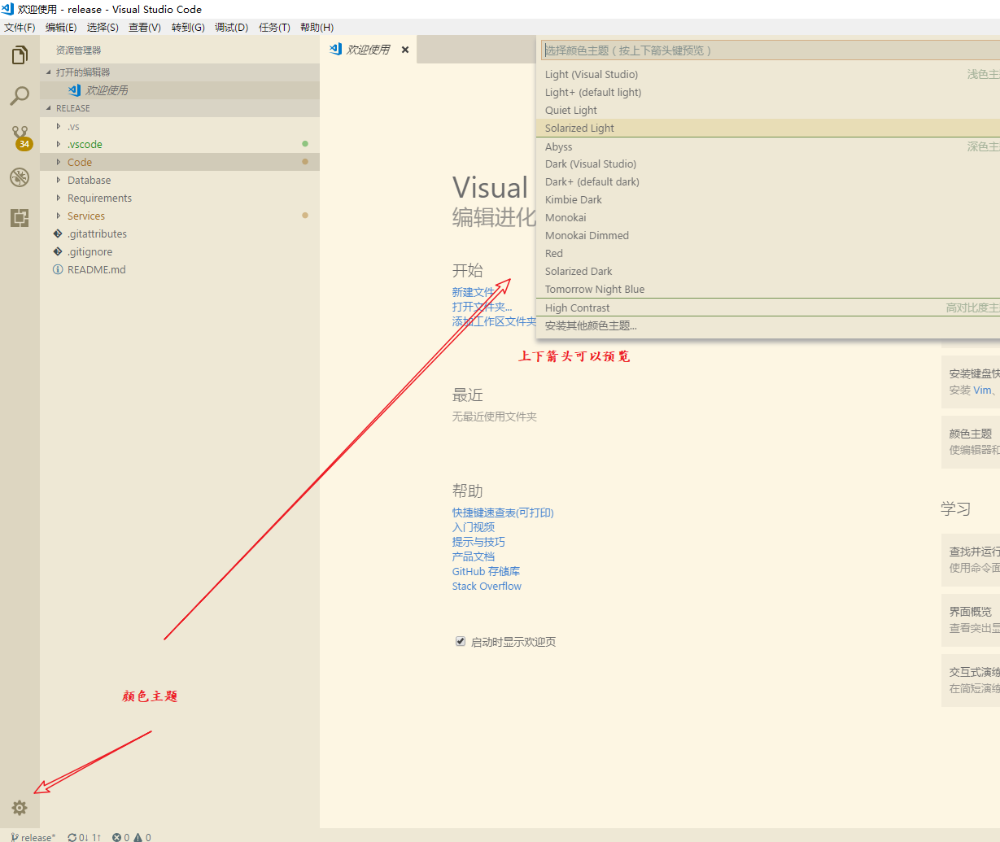

# 你好，我不只是C语言

## 编程能力是生活必需品

+ 明天是双11，酋长和室友约定要抢购刚出的AJ跑鞋，但是秒杀价只有一双。  

+ 时钟的指针悄悄滑向十点半，决战紫禁之巅的勇士们纷纷打开电脑手机，准备一年一度手速的决战。而这时酋长寝室的画风是这样的。。。。  

    + **皮皮** ：抢购啥鸭，我举报大肥还没做线代作业！  

    + **大肥** ：强哥快下线，你物理实验报告数据还没处理呢！  
  
    + **强哥** : 皮皮快开王者，今天活跃度还没满呢！酋长哥哥，我这里有道超有趣的方程，要不要来挑战一下？  

    + **酋长** ：zzz（均匀而有节奏的呼吸声）  

    + **皮皮、大肥**：酋长肯定又写了**脚本**了，不行，快使出干扰战术。强哥，是展现你男性魅力的时候了。  

    + **强哥**: 酋长哦尼桑，人家超菜的，真的做不出来了咩，再不教人家用小拳拳捶你胸口哦。  

    + **酋长** ：（勉强挣扎起床，缓慢打开电脑，慢条斯理地coding)  

------------

+ (10分钟过后)  

    经过了一番紧张刺激de代码交换（~~不可描述的交易~~）此处友情链接：  

    [线代脚本](https://github.com/Tarpelite/BUAA_C_tutorial/tree/master/%E7%AC%AC%E4%B8%80%E7%AB%A0/%E7%BA%BF%E6%80%A7%E4%BB%A3%E6%95%B0 "线代脚本")  
    [某宝秒杀脚本](https://github.com/Tarpelite/BUAA_C_tutorial/blob/master/%E7%AC%AC%E4%B8%80%E7%AB%A0/1-4_%E6%B7%98%E5%AE%9D%E7%A7%92%E6%9D%80%E8%84%9A%E6%9C%AC.py "某宝秒杀脚本")  
    [物理实验处理脚本](https://github.com/Tarpelite/BUAA_C_tutorial/blob/master/%E7%AC%AC%E4%B8%80%E7%AB%A0/%E4%B8%80%E5%85%83%E7%BA%BF%E6%80%A7%E5%9B%9E%E5%BD%92%E6%96%B9%E7%A8%8B.cpp "物理实验处理脚本")  
    [以及某非酋的黑科技脚本库](https://github.com/Tarpelite/BUAA_C_tutorial "代码仓库")  

    反正他们看过了之后反应是这样的。。。

    + **皮皮**：大肥你线代做完了吗？我王者今天5个箱子了，你有丶菜菜哦  

    + **大肥**： 打扰了，线代不是分分钟的事么，我要举报强哥数据还没做完就玩某宝！  

    + **强哥**: 嘤嘤嘤，数据处理么就是填空题哇，我要是超过5分钟我就是女装大佬 。  

    + **酋长**：（慢调斯理地合上电脑）嗯，crontab脚本时间没错 。

+ 寝室里又响起了酋长均匀而有节奏地呼吸声。。。

+ 在这个宁静而又美好的夜晚，大家都收到了单身狗的祝福，有人上位王者，有人收到了线代助教姐姐的亲切问候，有人收获了有史以来第一份完全干净整洁不用因为编数据而改来改去的实验报告。。。  

  


+ 第二天，酋长正花痴般地抱着新收到的AJ跑鞋留着口水，忽然发现昨天夜里微信居然收到了256条一模一样的信息，**我要学编程鸭！！！！！**

------------

### 计算机如何解决问题  

酋长今天想喝水，那么酋长会怎么做呢？  

1. 找到一个杯子
2. 排队
3. 接水
4. 坐下来喝水

```cpp
    int main()
    {
        getCup();
        wait();
        getWater();
        sitDownAndDrink();
    }
```

完成这四步之后，酋长并没有喝到水。酋长佷郁闷。。。不是说好程序员只负责what to do的嘛，how to do 是计算机的事吧ORZ

于是酋长和他的小伙伴们决定做了一系列教程（what to do && how to do) ，这样以后走到哪里都会有人打赏冰阔落了  
 


## 次回预告：今天你skr程序猿  

英雄未买，皮肤先行，作为一个有深度有内涵有修养的现代大学生（~~程序猿~~），在写程序之前应该有如下神器：  
  
1. 可甜可盐，集小狼狗与小奶狗气质于一身的颜值爆表[IDE](https://baike.baidu.com/item/%E9%9B%86%E6%88%90%E5%BC%80%E5%8F%91%E7%8E%AF%E5%A2%83/298524?fr=aladdin)? 



2. 静如福尔摩斯，动如小闪超蝙的全宇宙必备追踪debug神器GCC


