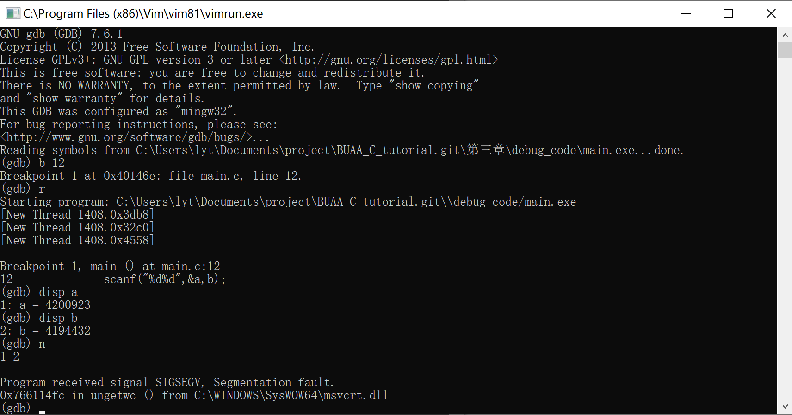
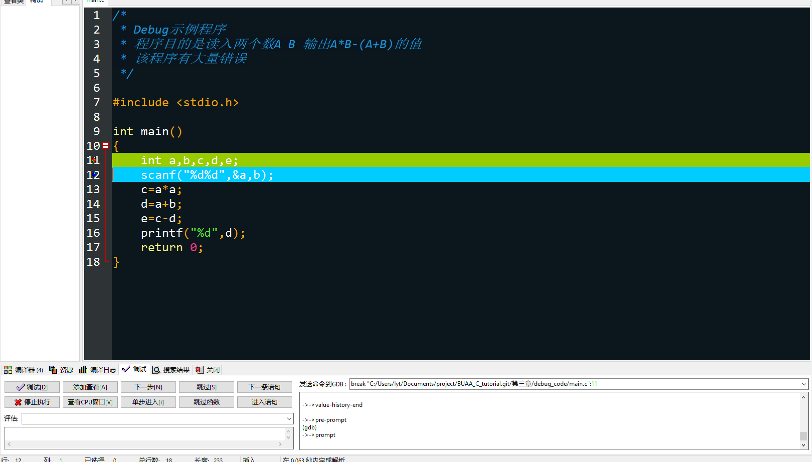
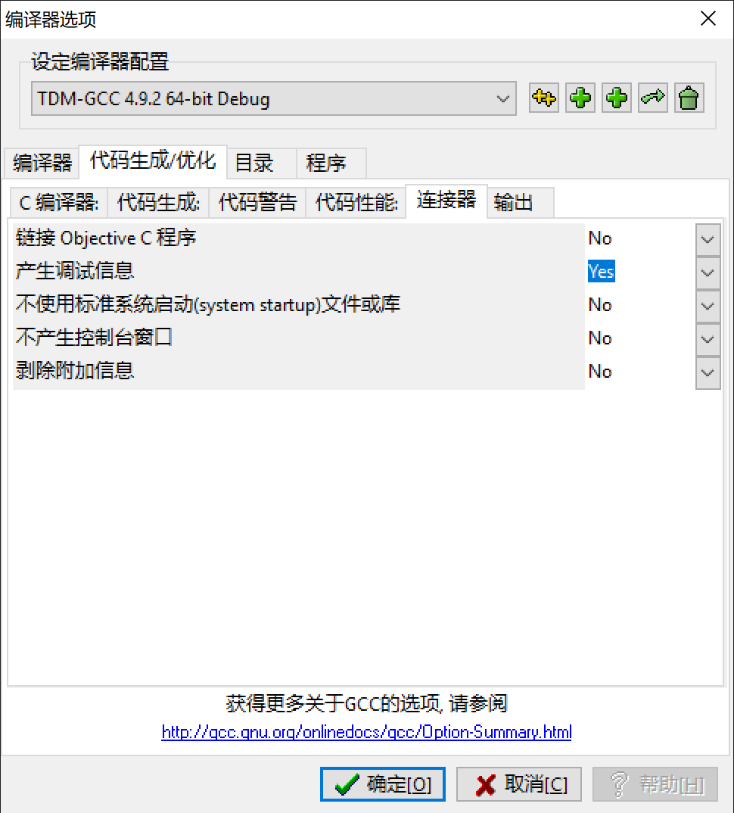
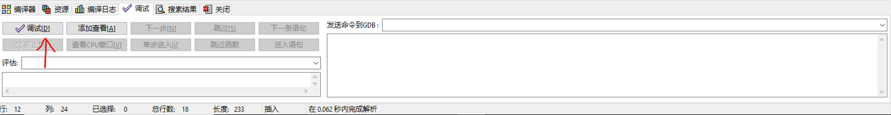
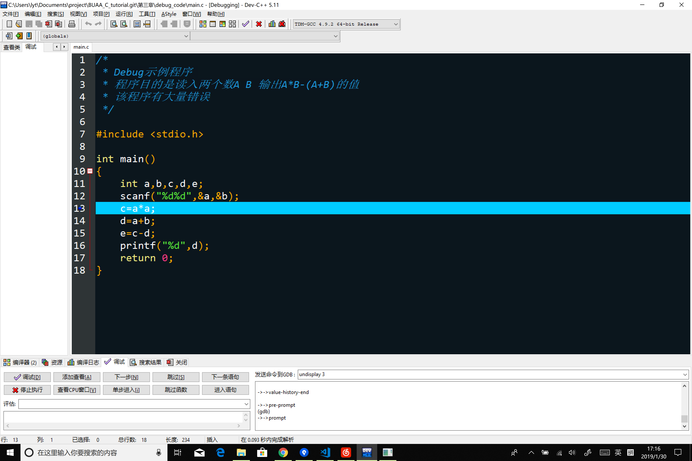
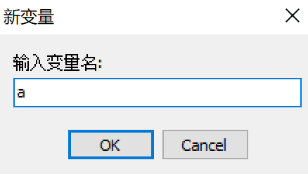
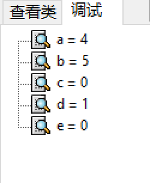
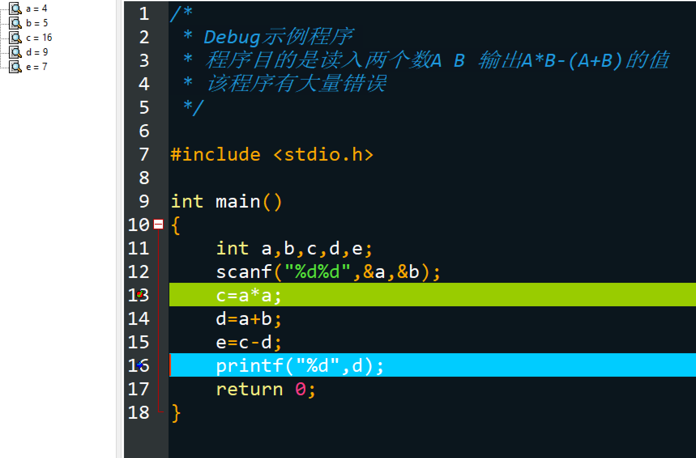
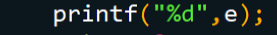
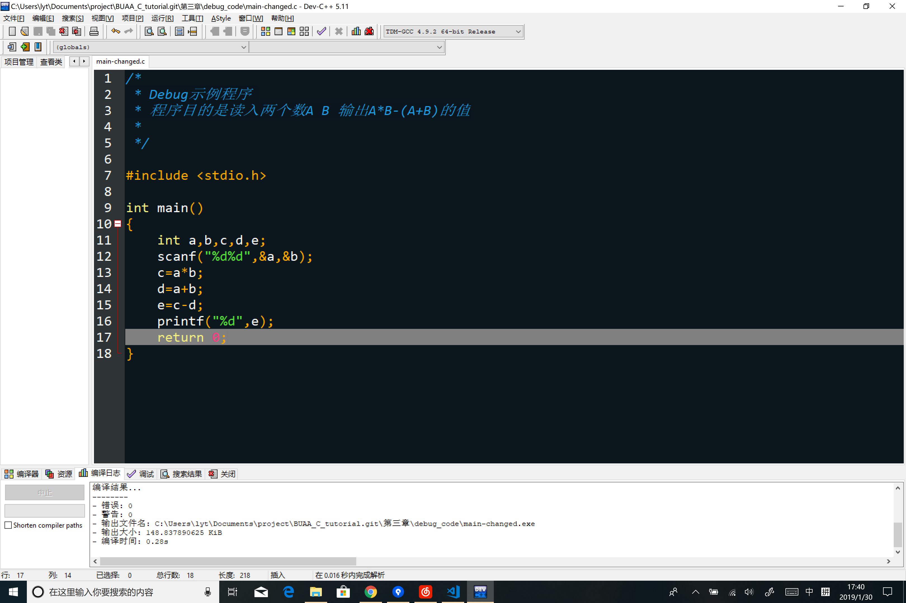

# 捕虫(debug)是个技术活

##怎么Debug

+ C语言的脸熟赛上线了。这天，酋长呆在家里无所事事，于是登陆OJ，很快的刷完的所有的题，下线开始摸鱼。
###晚上
+ （QQ消息）**皮皮**：酋长你在吗，有学妹说她代码怎么都运行不对，把代码截图问我，我看不出来问题嘤嘤嘤。
+ **酋长**：行吧，你把代码给我看看
+ **皮皮**：（图片）
+ **酋长**：这么长！这代码太长我光看图片看不出来啊，我还是得有一份源代码来**调试**才行。
+ **皮皮**：那我让学妹直接找你。
+ ………………
+ **学妹**：学长，我这代码交上去总是反馈给我WA（注：结果错误），我看代码也看不出问题啊，为什么啊？
+ **酋长**：这代码稍微有一点多了，直接看的话的确不好看出来Bug在哪里，你得输入一些数据来进行**调试**。
+ **学妹**：学长该怎么调试呢。
+ **酋长**：调试一般都是自己**造一些数据**，**输入**进自己的程序，然后根据**运行结果**，**查看中间变量**，等等，来**修正程序的错误**（比如**逻辑错误**和**语法错误**）。
+ **酋长**：一般来说，Debug时，会使用特别的工具软件，可以让程序在特定地方停下来，然后可以查看程序中某个变量，可以单步运行……
+ **学妹**：emmmmm，那具体该怎么办呢，你教教我嘛
+ **酋长**：好哒。

## 详解codeblocks和DevC++ debug
最原始的调试，是在**编译**时加上特定的指令（如gcc是加上-g），使用特定的Debug软件（如gdb），来实现的。
但是这一般是命令行界面，因此不是很直观（如下图)。



我们使用的大部分IDE都集成了Debug软件，让我们可以更直观的使用“调试”功能来Debug。



***接下来以Dev-c为主要软件讲解调试***
我们以一下程序为实例：
```c
/*
 * Debug示例程序 
 * 程序目的是读入两个数A B 输出A*B-(A+B)的值
 * 该程序有大量错误
 */

#include <stdio.h>

int main()
{
	int a,b,c,d,e;
	scanf("%d%d",&a,b);
	c=a*a;
	d=a+b;
	e=c-d;
	printf("%d",d);
	return 0;
}
```
首先我们随便想几组数据，输入测试，当我们输入````4 5```` 这组数据时，发现没有运行结果，报错，因此我们需要调试。

首先在Dev-c中在 ***工具/编译选项*** 中将以下选项打开


然后是设置断点，断点即为程序中断的地方，在在调试时，程序将会在运行到这一行时暂停。
一般在认为会出bug的地方前设置
点击行号以设置断点


然后点击调试。


(两个均可)

然后程序将会在断点出停下
(注意，如果程序在断点前出现了输入，依然需要在命令行窗口中输入后继续运行)

这里我们输入数据为

	4 5

如果你也跟着一起运行了，你会发现这时候出现了错误窗口，意味着出现了错误，我们需要先改正。由于是在断点所在行或之前行出现得问题，我们可以缩小搜索范围。眼尖得同学肯定已经看见了，scanf没写&符号，我们先停止调试，把它加上。


重新运行程序，输入````4 5````，发现运行结果有问题。

继续以13行为断点，重新调试。(注意，如果程序在断点前出现了输入，依然需要在命令行窗口中输入后继续运行)
现在这里蓝色的那一行，就表示当前暂停得那一行，同时该行还没运行。

然后我们点击**添加查看**，查看变量，这里要查看a，b，c，d，e五个变量。

添加完后看左边

可以看到当前各个变量的值。


然后，我们点击“下一步”按键，一行一行运行程序，同时观察左侧的值是否符合预期。


我们可以发现，c、e的值不正确，c应该为````4*5=20````,而这里是16，而e也因此不正确。仔细观察程序，追踪c的值的来源，可以发现是13行这一步的赋值得到的c的值，而阅读程序，可以发现赋值式子写错，应该为```` c=a*b;````于是在此，我们将其改正。


重新运行程序，输入````4 5````，发现输出结果有问题。
结合之前的调试情况，我们知道e的计算没有问题了，同时e储存的也是正确结果。这说明我们输出写错了。查看第16行，我们发现，我们输出了变量e。因此更改。


重新运行程序，输入````4 5````，运行结果正确，则说明我们的程序在````4 5````这组输入下没有问题了。

最终Debug成果：


注意，某一组测试数据通过了，不意味着你的代码是逻辑正确的了。比如如果这里输入的是```2 2```，是调试不出```a*a```这个错误的

关于code::blocks软件中的的调试功能的使用，与Dev-c大同小异。较为明显的区别是设置断点的方式，相信你可以通过寻找菜单的方式解决。 

以上只是基本的Debug方法，调试功能中，还有其他的功能可以方便你的Debug，未来你可以去尝试。
同时，Debug时还会遇到更为复杂的情况，这时候你的经验就时很重要的东西了。但是，如果遇到不知道为什么的情况该怎么办呢，这时候，就需要——上网查了。

## 如何使用stack Overflow 和 CSDN 查找


## Github入门级教程  


## 调试代码的一些小tips