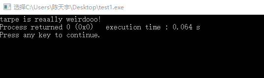
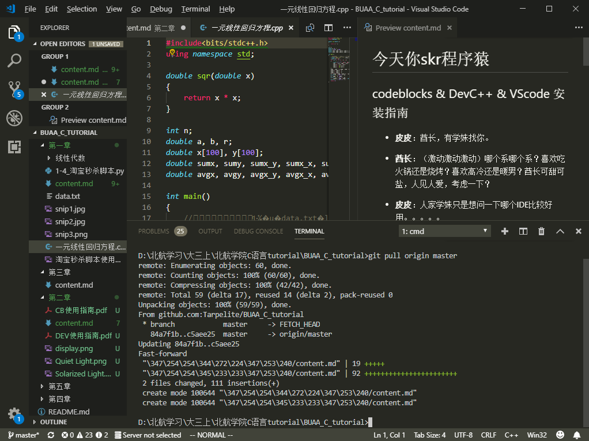

# 今天你skr程序猿

## codeblocks & DevC++ & VScode 安装指南

+ **皮皮**：酋长，有学妹找你。
+ **酋长**：（激动激动激动）哪个系哪个系？喜欢吃火锅还是烧烤？喜欢高冷还是暖男？酋长可甜可盐，人见人爱，考虑一下？  
+ **皮皮**：人家学妹只是想问一下哪个IDE比较好用。。。。。
+ **酋长**：哦（失望脸），古老的codeblocks安装和使用请参考[codeblocks使用指南](http://image.buaacoding.cn/CB%E4%BD%BF%E7%94%A8%E6%8C%87%E5%8D%97.pdf),更古老的DEV-C++安装和使用请参考[DEV-C++使用指南](http://image.buaacoding.cn/DEV%E4%BD%BF%E7%94%A8%E6%8C%87%E5%8D%97.pdf)  
+ **学妹**：听说酋长哥哥的IDE颜值爆表，好像不是这几款鸭  
+ **酋长**：（1/24秒切换表情）哈哈哈哈哈哈，那现在隆重推出地表最强IDE的**弟弟**——Visual Studio Code, CSDN上刚好有一篇安装教程[VScode使用指南](https://blog.csdn.net/feynman1999/article/details/79437524)  

+ **学妹**：好哒，我这就去试试哈哈哈
+ **酋长**：顺便，酋长可甜可盐，人见人。。。。
+ **学妹**：学长再见（微笑脸） 
+ **酋长**：考虑一下嘛~嘤嘤嘤。。。

## Hello World!——第一次编程

+ **皮皮**：酋长，有学妹找你。  
+ **酋长**：（激动激动激动）哪个系哪个系？喜欢吃火锅还是烧烤？喜欢高冷还是暖男？酋长可甜可盐，人见人爱，考虑一下？   
+ **皮皮**：人家只是想请教一下第一次编程啊喂
+ **酋长**：哦（巨失望脸），一个简单的C语言程序包括一个基本的IO头文件(<stdio.h>)和一个main函数入口(int main())。。。  
+ **学妹**：（这个奇怪的学长在说什么神奇宝贝）酋长，能不能手把手教一下人家吗，就写一个简单的就ok？  
+ **酋长**：（1/24秒切换表情），哈哈哈哈哈前面的都是废话，下面我们举个栗子。

```c
    #include<stdio.h>  /*引入头文件*/
    int main() /*定义程序入口*/
    {
        printf("tarpe is reaally coooool!")/*打印字符串*/
    }
```
+ **酋长**：然后我们编译运行一下。
+ **学妹**：这很简单啊，我懂了，谢谢学长（溜）  
+ **酋长**：不再看一下运行结果嘛，还有酋长可甜可盐，人见人爱，考虑一下下啊。。。  
+ **酋长**：（看了运行结果）纳尼？！  
  


## VScode 自定义主题  

+ **皮皮**：酋长，有学妹找你。  
+ **酋长**：（激动激动激动）哪个系哪个系？喜欢吃火锅还是烧烤？喜欢高冷还是暖男？酋长可甜可盐，人见人爱，考虑一下？   
+ **皮皮**：酋长，你冷静一点，人家来找你调个配色方案而已。。。  
+ **酋长**：哦（螺旋爆炸失望脸），第一步，打开浏览器，第二步，打开百度，第三步。。。。
+ **学妹**：可是可是我不知道哪个方案比较好看嘛？（blingbling地看向酋长）  
+ **酋长**:（1/24秒切换表情），哈哈哈哈学妹你喜欢浅色还是深色，我这里有全套高颜值主题。 

  
  
  
  

+ **酋长**：在vscode的商店里可以选择各式各样的皮肤（都是免费的），然后在设置里切换主题就ok啦。
+ **学妹**：都不好看，太直男审美了，我要自己去找。
+ **酋长**：这是我的微信，学妹，学妹加一下再走啊（暴风QAQ）。
