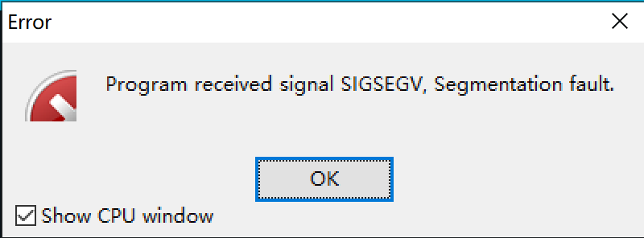

# 第二章 脱掉格子衫   

## 数据决定程序结构  

我知道大部分女生对程序是抵制的，恨乌及屋，对程序员自然也是没啥好感，除了帮抢演唱会门票以及京东秒杀脚本时，会勉为其难地喊出”斯国耶"之外，仿佛程序员就是另一个物种。当然这不能怪程序员，因为我们只穿格子衫，格子衫的条纹很多，但花样并不多，只是简单的线条和方格这类元素的重复而已。于是自然而然的，一些程序员尤其是新手，会写出”格子衫“代码 —— 充满了简单而无意义的重复，庞大而丑陋，而它们本可以写得清晰而漂亮。我见过一些程序，它们本质上相当于以下的代码。 

```c  
    if(k == 1) c001++; 
    if(k == 2) c002++;
    if(k == 3) c003++;
    ...
    if(k == 500)c500++;
```  

虽然这些程序确实也完成了一些复杂的任务（1到500出现次数的计数），但是代码长度可能会超过520行。我们可以使用这个数字零头的代码量完成相同的工作，方法就是使用一种不同的数据结构——一个有500个元素的数组来代替500个独立变量。恰当的数据结构决定了程序的结构，也决定了代码的美感。  

写代码不需要格子衫，也不需要机械键盘，也不需要4K曲屏，当然这些可以让你看起来很Geek，却不是这个教程真正想告诉你们的。我们不是码农，是创造者，解决问题当然是我们的职责，却不是我们真正的追求，如何简洁、正确、清晰地用代码表达思维的美感，才是创造者的使命。  

## 如何养成防脱发的程序员价值观  

写码之前请在心中默念： 

> Beautiful is better than ugly.
> Explicit is better than implicit.  
> Simple is better than complex.
> Complex is better than complicated.  
> Flat is better than nested. 
> Sparse is better than dense.
> Readability counts.
> Special cases aren't special enough to break the rules.  
> Although practicality beats purity.
> Errors should never pass silently. 
> Unless explicitly silenced.  
> In the face of ambiquity, refuse the temptation to guess.  
> There should be one-- and preferably only one --obvious way to do it.
> Now is better than never.
> Although never is often better than *right* now.
> If the implementation is hard to explain, it's a bad idea.
> If the implementation is easy to explain, it may be a good idea.
 

当然，顺便附上中文版：  
> 优美胜于丑陋  
> 明了胜于晦涩  
> 简洁胜于复杂  
> 复杂胜于凌乱  
> 扁平胜于嵌套  
> 间隔胜于紧凑  
> 可读性很重要  
> 即便假借特例的实用性之名，也不可违背这些规则  
> 不要包容所有错误，除非你确定需要这样做
> 当存在多种可能，不要尝试去猜测
> 而是尽量找一种，最好是唯一一种明显的解决方案（如果不确定，就用穷举法）
> 做也许好过不做，但不假思索就动手还不如不做（动手之前要细思量）  
> 如果你无法向人描述你的方案，那肯定不是一个好方案  

## 学长的小课堂  

+ **学弟**：啊啊啊我脑容量不够啊，一次写代码能AC就不错了，根本管不了这么多啊。
+ **学长**：别慌，没有谁能一次写出完美的代码，编程能力的提高并不是看你AC了多少道题目，而是你的思维和编码方式是否是最优的，每次只要多多参考大佬的题解，慢慢改善，很快就会有进步哒。
+ **学弟**：可是有时候题解和自己的思路并不相同，很多问题没有精准的回答怎么办？  
+ **学长**：给你推荐两个网站：[Stack Overflow](https://stackoverflow.com/) 和 [CSDN](https://www.csdn.net/)，大多数问题都可以在这网站上查到。比如说编译错误的问题，你看不出来的话，就可以把编译的报错信息复制到这些网站的搜索界面去搜索。当然，也不局限于此，你也可以直接谷歌，去找问题啦。
+ **学长**：比如说吧，你还记得上次我给你演示调试的时候的代码的那个运行时的错误吗。
+ **学弟**：这个吗？

+ **学长**：对，如果你是第一次遇到的话，很可能不知道是为什么错吧。
+ **学弟**：是啊，根本看不出来是scanf写错了。
+ **学长**：那么，这种时候，就可以搜索这个内容了。简单的，你可以直接百度/必应/谷歌这段话的关键词，当然也可以在那两个网站的搜索框里直接搜啦。比如搜索“Segmentation fault”。我相信，[搜出来的内容里](https://so.csdn.net/so/search/s.do?q=Segmentation%20fault&t=%20&u=)，肯定会有相关的描述的。)
